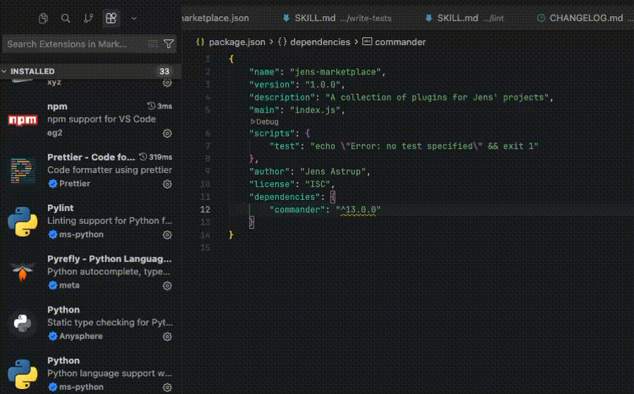
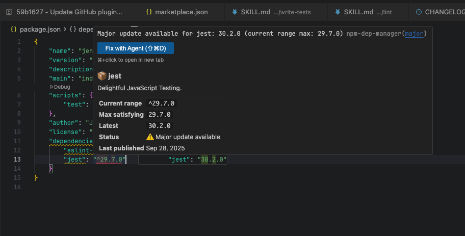
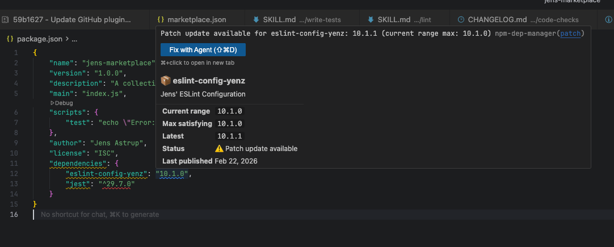

# Trawl — NPM Dependency Manager

**Zero-click outdated dependency warnings, version autocomplete, and rich hover info — all inside `package.json`.**

Trawl connects your editor directly to the npm registry. The moment you open a `package.json`, it silently fetches version data in the background and surfaces outdated dependencies as native VS Code diagnostics — no commands to run, no terminal to open, no sidebar to check.



---

## Features

### Automatic Outdated Dependency Warnings

Trawl scans every `package.json` in your workspace and highlights outdated packages inline using VS Code's native diagnostic system. Severity is semver-aware so the most important updates stand out:

| Update type | Severity | Indicator |
|---|---|---|
| Major | Error | Red underline |
| Minor | Warning | Yellow underline |
| Patch | Information | Blue underline |
| Prerelease | Hint | Subtle hint |

Outdated packages appear in the **Problems panel**, as **underlines in the editor**, and as **file decorations in the Explorer** — the same way TypeScript surfaces type errors. Diagnostics update automatically when you open a file, edit it, or save.



*Above: Trawl highlights a major outdated dependency with a red underline and error severity right inside `package.json`.*

#### Patch Update Example



*Above: Trawl highlights a minor outdated dependency with a yellow underline and warning severity.*


### Rich Hover Information

Hover over any package name or version string to see a full summary pulled live from the registry:

- Package description
- Your current version range
- The highest version your range satisfies
- The absolute latest published version
- Update status and update type
- Last published date
- Links to the npm page and package homepage

### Version Autocomplete

When your cursor is inside a version string in any dependency group, Trawl shows a completion list of real npm versions. The latest stable release is always at the top, followed by other dist-tags (`next`, `beta`, `rc`), then the 30 most recent versions in descending order — each annotated with its publish date.

Suggestions preserve your range prefix. If your current range uses `^`, completions are offered as `^x.y.z`. If you use `~`, you get `~x.y.z`. Exact versions are also suggested.

### One-Click Quick Fixes

Every outdated dependency warning includes a lightbulb quick-fix menu (`Cmd+.` / `Ctrl+.`):

- **Update to latest** — rewrites the version string to the latest release, preserving your `^`/`~` prefix
- **Pin to exact version** — replaces the range with a pinned exact version
- **Open on npm** — opens the package page in your browser

### Monorepo Support

Trawl automatically discovers and analyzes all `package.json` files across your workspace, excluding `node_modules`. All packages are fetched concurrently so even large monorepos load quickly.

### Smart Caching

Registry responses are cached in memory with a configurable TTL (default: 30 minutes). Concurrent requests for the same package are deduplicated — if two files both depend on `react`, only one network request is made. A background refresh runs proactively when cached data approaches expiry, keeping hover and diagnostic responses instant. If a network request fails, Trawl falls back to stale cache data rather than dropping diagnostics.

---

## Commands

Access these from the Command Palette (`Cmd+Shift+P` / `Ctrl+Shift+P`):

| Command | Description |
|---|---|
| `NPM: Check Outdated Dependencies` | Re-analyze all open `package.json` files |
| `NPM: Refresh Dependency Cache` | Clear the cache and re-fetch all package data from the registry |

---

## Configuration

All settings are under the `npmDepManager` namespace in VS Code Settings.

| Setting | Default | Description |
|---|---|---|
| `npmDepManager.enableDiagnostics` | `true` | Enable automatic outdated dependency warnings |
| `npmDepManager.enableVersionAutocomplete` | `true` | Enable version string autocomplete |
| `npmDepManager.enableHover` | `true` | Enable hover information |
| `npmDepManager.cacheTTLMinutes` | `30` | How long to cache registry data (minutes) |
| `npmDepManager.concurrency` | `6` | Maximum concurrent registry requests |
| `npmDepManager.ignoredPackages` | `[]` | Package names to exclude from all checks |

### Ignoring packages

Add packages to skip — useful for internal packages, workspace references, or dependencies you intentionally keep at an older version:

```json
{
  "npmDepManager.ignoredPackages": ["some-internal-package", "legacy-dep"]
}
```

---

## Notes

- Version strings that reference non-registry sources are skipped: `file:`, `link:`, `workspace:`, `git+`, `http://`, `https://`, and `*`.
- All four dependency groups are supported: `dependencies`, `devDependencies`, `peerDependencies`, and `optionalDependencies`.
- The extension activates automatically when a workspace contains any `package.json` file.

---

## Requirements

VS Code 1.85.0 or later.
