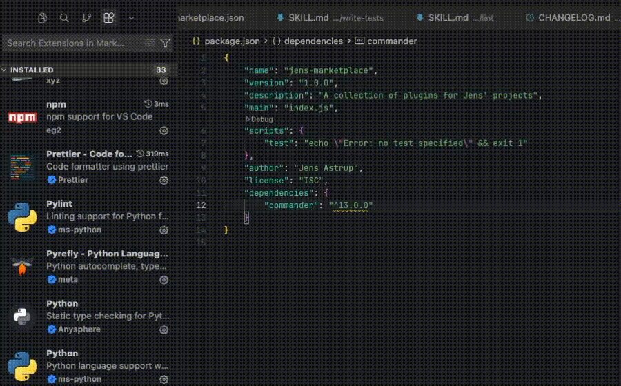
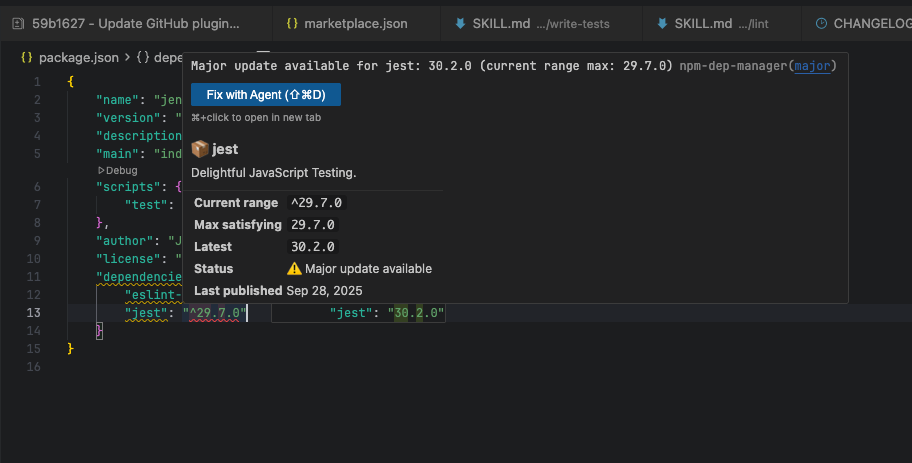
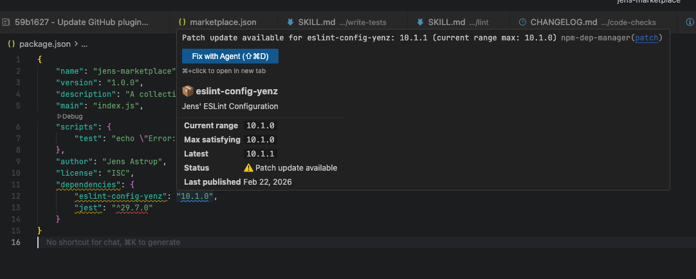

# Trawl — Dependency Manager

**Zero-click outdated dependency warnings, version autocomplete, and rich hover info — for npm `package.json` and Python `requirements*.txt`.**

Trawl connects your editor directly to the npm registry and the Python Package Index (PyPI). The moment you open a `package.json` or a `requirements*.txt`, it silently fetches version data in the background and surfaces outdated dependencies as native VS Code diagnostics — no commands to run, no terminal to open, no sidebar to check.



---

## Supported files

| Ecosystem | Files | Registry | Version rules |
|---|---|---|---|
| npm | `package.json` | [npmjs.com](https://www.npmjs.com) | semver |
| Python | `requirements.txt`, `requirements-dev.txt`, `requirements/*.txt`, … (`requirements*.txt`) | [PyPI](https://pypi.org) | PEP 440 |

Both ecosystems get the same feature set; the differences are noted per feature below.

---

## Features

### Automatic Outdated Dependency Warnings

Trawl scans every supported manifest in your workspace and highlights outdated packages inline using VS Code's native diagnostic system. Severity is version-aware so the most important updates stand out:

| Update type | Severity | Indicator |
|---|---|---|
| Major | Error | Red underline |
| Minor | Warning | Yellow underline |
| Patch | Information | Blue underline |
| Prerelease | Hint | Subtle hint |

Outdated packages appear in the **Problems panel**, as **underlines in the editor**, and as **file decorations in the Explorer** — the same way TypeScript surfaces type errors. Diagnostics update automatically when you open a file, edit it, or save.



*Above: Trawl highlights a major outdated dependency with a red underline and error severity right inside `package.json`.*

#### Patch Update Example



*Above: Trawl highlights a minor outdated dependency with a yellow underline and warning severity.*


### Rich Hover Information

Hover over any package name or version to see a full summary pulled live from the registry:

- Package description
- Your current version range / specifier
- The highest version your range satisfies
- The absolute latest published version
- Update status and update type
- Last published date
- Links to the package's registry page (npm or PyPI) and homepage

### Version Autocomplete

When your cursor is inside a version string, Trawl shows a completion list of real versions from the registry, each annotated with its publish date.

- **npm** — the latest stable release is at the top, followed by other dist-tags (`next`, `beta`, `rc`), then the 30 most recent versions in descending order. Suggestions preserve your range prefix: `^` ranges are offered as `^x.y.z`, `~` ranges as `~x.y.z`, plus the exact version.
- **Python** — the latest version is offered as a pin (`==x.y.z`) and a lower bound (`>=x.y.z`), followed by recent versions.

### One-Click Quick Fixes

Every outdated dependency warning includes a lightbulb quick-fix menu (`Cmd+.` / `Ctrl+.`):

- **Update to latest** — rewrites the version to the latest release, preserving your prefix/operator (`^`/`~` for npm, `==`/`>=`/… for Python)
- **Pin to exact version** — pins to the latest (`x.y.z` for npm, `==x.y.z` for Python)
- **Open on npm / PyPI** — opens the package page in your browser

### Monorepo Support

Trawl automatically discovers and analyzes all supported manifests across your workspace (`package.json` excluding `node_modules`, and every `requirements*.txt`). Packages are fetched concurrently so even large repos load quickly.

### Smart Caching

Registry responses are cached in memory with a configurable TTL (default: 30 minutes). Concurrent requests for the same package are deduplicated — if two files both depend on `react` (or `requests`), only one network request is made. A background refresh runs proactively when cached data approaches expiry, keeping hover and diagnostic responses instant. If a network request fails, Trawl falls back to stale cache data rather than dropping diagnostics. npm and PyPI each have their own independent cache.

---

## Commands

Access these from the Command Palette (`Cmd+Shift+P` / `Ctrl+Shift+P`):

| Command | Description |
|---|---|
| `Trawl: Check Outdated Dependencies` | Re-analyze all open manifest files |
| `Trawl: Refresh Dependency Cache` | Clear the cache and re-fetch all package data from the registries |

---

## Configuration

All settings are under the `trawl` namespace in VS Code Settings and apply to both ecosystems.

| Setting | Default | Description |
|---|---|---|
| `trawl.enableDiagnostics` | `true` | Enable automatic outdated dependency warnings |
| `trawl.enableVersionAutocomplete` | `true` | Enable version string autocomplete |
| `trawl.enableHover` | `true` | Enable hover information |
| `trawl.cacheTTLMinutes` | `30` | How long to cache registry data (minutes) |
| `trawl.concurrency` | `6` | Maximum concurrent registry requests |
| `trawl.ignoredPackages` | `[]` | Package names to exclude from all checks |

### Ignoring packages

Add packages to skip — useful for internal packages, workspace references, or dependencies you intentionally keep at an older version:

```json
{
  "trawl.ignoredPackages": ["some-internal-package", "legacy-dep"]
}
```

---

## Notes

- **npm:** version strings that reference non-registry sources are skipped: `file:`, `link:`, `workspace:`, `git+`, `http://`, `https://`, and `*`. All four dependency groups are supported: `dependencies`, `devDependencies`, `peerDependencies`, and `optionalDependencies`.
- **Python:** only pinned/comparable requirements are checked. Comments, pip directives (`-r`, `-c`, `-e`, `--hash`, …), environment markers (`; python_version < "3.8"`), extras (`requests[security]`), and URL/VCS direct references are ignored. Extras and markers are stripped before the package is looked up.
- The extension activates automatically when a workspace contains any `package.json` or `requirements*.txt` file.

---

## Requirements

VS Code 1.85.0 or later.
